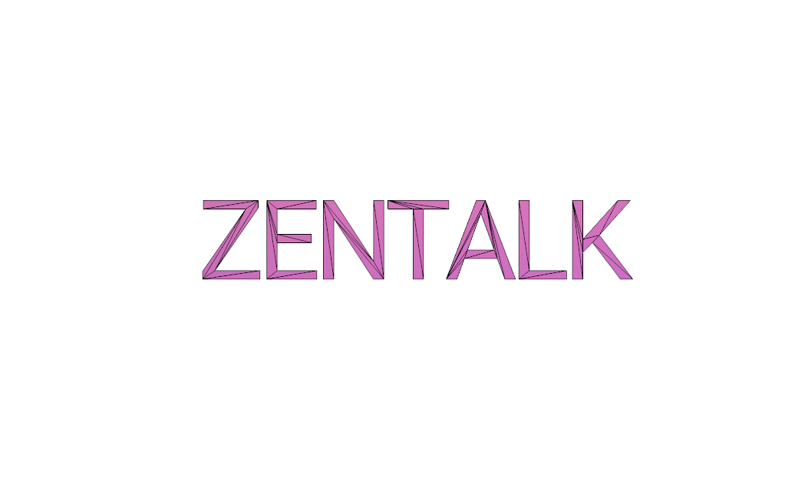

  </img>

#### "Zentalk Mobile App Beta Version will not be fully open-source until a stable version is published. Thanks for your understanding, we try to make the most of our products as open-source! DO NOT FORK, THANK YOU."

Zentalk is a highly secure hybrid encryption, decentralized and peer-to-peer messenger app. Next to great usability, under the hood, you’ll find state-of-the-art encryption with AES-256, Diffie-Helman, RSA and El-Gamal security. Zentalk is decentralized, it has no server point. Zentachain guarantees full anonymity and offline communication between the sender and receiver using Zentanodes, inclusive hashing function Blake2 and the Tor-network.

#### Timestamp & Features

- [x] Tor-Protocol 15.05.2019

- [x] Panic-button

- [x] User contact-list is encrypted and stored on user's own device 22.06.2019

- [x] Adding Contact at area distance 25.08.2019

- [x] Auto delete messages (Set-Timer) 07.10.2019

- [x] Save images with warning

- [x] Auto Logout Timer 17.10.2019

- [x] Emoji 25.10.2019

- [x] Stop Over Tracking & Spying by other Apps (Instagram, Facebook, Amazon,..)

- [x] Adding Images 02.11.2019

- [x] Sharing User HashedId Random

- [x] Adding Files

- [x] QR-Code Generate HashId

- [x] QR-Code Share HashId

- [ ] QR-Code Scan HashId

- [ ] QR-Code Scan ZentanodeId

- [ ] Hashing Signature

- [ ] Notification & Authorisation

- [ ] Blog/News

- [ ] Decentraized database Wallet

- [ ] Meshed Lightning

- [x] Anti Google-Tracking

- [x] Identicon Avatars

#### Features:

- [x] Block Screenshot

- [x] Group Chat

- [ ] Calls & Videocalls

- [ ] Multi Calls & Videocalls

- [ ] Voice Message

- [ ] PDF View

- [x] Private Group 24.03.2020

- [x] Mobile Encrypted

- [ ] Anti-Device-Forensic

#### Zentalk protection:

- [x] Password recover: No

- [x] System-Encryption

- [x] No-Server

- [x] Non-Backup

- [x] Anti-middle-men

- [x] Nickname

- [x] Anti-SimSwap

- [ ] Hide App

- [ ] Rename App

- [ ] Change Icon

- [x] GPS Blocker

#### Supported Files:

- [x] JPEG 
- [x] PNG
- [ ] PDF
- [ ] GIF 
- [ ] MP4 
- [ ] WAV 
- [ ] Audio

#### Zentalk Encryption & Hashing:

- [x] Quantum Computer Safe

- [x] Key Size AES-256 Bit (14-Rounds)

- [x] Block Size 128 Bit

- [x] Hash: BLAKE2

- [ ] Hybrid Encryption

- [ ] El-Gamal Key Exchange

#### Zentawallet Payment:

- [ ] Bitcoin & Ethereum & Zenta

- [x] Send Bitcoin & Zenta over the Zentameshnet (Offline)

- [x] Create Offline Wallet / Store your PrivateKey (Offline)

- [ ] Hide IP-Address & Send payment via Tor-Network

- [ ] Lightning Network

- [x] QR Code Keystore (Offline)

#### Zenta Blockchain:

- [ ] Zenta PoS

- [ ] ZUSD

#### Zentanode:

- [x] SHA-256

- [x] Search nearby Zentanode

- [ ] Connect to a nearby Zentanode

- [ ] ZentaMWAN

- [ ] Reward with Zenta

#### Zentagate:

- [x] Zentalk-Gateway 07.08.2019

- [ ] Search nearby Zentagateways

- [x] Handshake with Zentagate

- [ ] AES Encryption

- [ ] Handshake with Nearby Nodes

#### Offline Range:

- [x] Zentalk offline communication works 20 meters. 15.04.2019

- [x] Zentalk offline communication works 50 meters. 26.04.2019

- [x] Zentalk offline communication works 100 meters. 09.05.2019

- [x] Zentalk offline communication works 1000 meters. 19.02.2020

- [ ] Zentalk offline communication works 5000 meters.

- [ ] Zentalk offline communication works 15000 meters.

- [ ] Zentalk offline communication works 25000 meters.

- [ ] Zentalk offline communication works 35000 meters.

#### Data transfer Online size:

- [x] 100 Mb

- [ ] 450 Mb

#### Data transfer Offline size:

- [x] 10 Mb 19.02.2020

- [x] 50 Mb 09.07.2020

- [ ] 150 Mb

- [ ] Unlimited Size

#### Networks:

- [ ] Zentamesh Network 868MHz

- [ ] Zajin Network 902MHz

- [ ] Zikaron Network  922MHz

##### For moore see:

* [Zentameshnet](https://github.com/ZentaChain/Zentamesh)

#### Penetration Test & Hacking:

- [x] Crash Test

- [x] Wifi

- [x] Zentamesh Network 868Mhz

- [ ] Zajin Network 902MHz

- [ ] Zikaron Network  922MHz

- [ ] Data Transfer

- [ ] Stress Testing & MWAN Bandwidth

- [ ] Range Offline Test

- [ ] Pen test the networks

#### Languages:

- [x] English

- [x] German

- [ ] Turkish

- [ ] Russian

- [ ] Chinese

- [ ] Korean

#### Theme:

- [x] Deep Black-Theme(Mod)

- [x] White-Theme(Mod)

- [ ] Dark-Theme(Mod)

- [ ] Multicolor-Theme(Mod)

- [ ] Zombi-Theme(Mod)

#### Go to Zentameshnetwork:
-----

#### The Zentachain Whitepapers 1.2 2020/Q1

* [Zentachain Whitepaper English 1.2](https://github.com/ZentaChain/PDF-Documents/blob/master/Zentachain-Whitepaper.pdf)

* [Zentachain Whitepaper Turkish 1.2](https://github.com/ZentaChain/PDF-Documents/blob/master/ZentachainTurkishWhitepaper.pdf)

-------------

<h3 align="center">This project is under active development, there may be breaking changes.</h3>

<h3 align="center">All copyright rights reserved Zentachain.io</h3>
